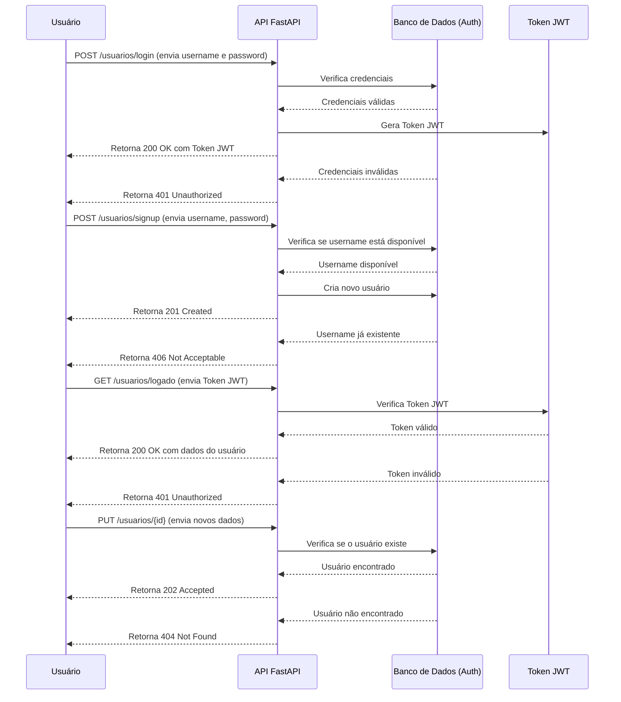
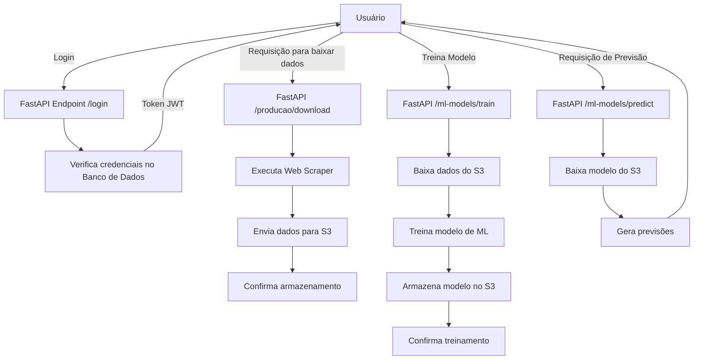
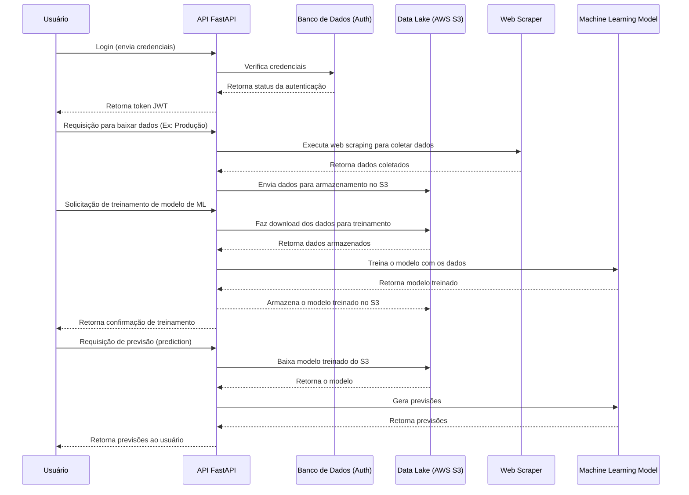

# FastAPI API Documentation

- Este repositório contém a implementação de uma API desenvolvida em FastAPI para manipular dados relacionados de produção, importação, exportação e comercialização de produtos da http://vitibrasil.cnpuv.embrapa.br .
A aplicação utiliza uma arquitetura de Data Lake no AWS S3 para que possa armazenar arquivos na Vinícola e posteriormente trabalhar em cima dos dados desses arquivos. 
Inicialmente, como primeira etapa desse projeto pensamos em uma arquitetura enxuta porem capaz de atender todas as necessidades de manipulação dos dados, de forma que torna simples e de baixo custo a expansão do projeto.
A aplicação também tem um pequeno recurso piloto que faz uso de machine learning para previsões de dados.


# Funcionalidades

- **Autenticação via JWT**: A API utiliza autenticação baseada em JWT para proteger os endpoints.
- **Operações com AWS S3**: Faz upload e download de arquivos para o S3 e manipula arquivos em formato Parquet.
- **Previsões com Machine Learning**: Modelos de previsão para diferentes produtos baseados em séries temporais.
- **Web Scraping**: Extrai dados de URLs específicas e armazena no data lake S3.

# Endpoints

- **Autenticação**:

  - **POST /usuarios/login**: Autentica um usuário e retorna um token JWT.
    - **Parâmetros**:
      - **username**: string - Nome de usuário
      - **password**: string - Senha do usuário
    - **Resposta**: 
     - **200 OK**: Token JWT válido
     - **401 Unauthorized**: Credenciais inválidas

  - **POST /usuarios/signup**: Cria um novo usuário.
    - **Parâmetros**:
      - **username**: string - Nome de usuário
      - **password**: string - Senha do usuário
      - **admin**: boolean (opcional) - Indica se o usuário terá privilégios de administrador
    - **Resposta**: 
      - **201 Created**: Usuário criado com sucesso
      - **406 Not Acceptable**: Nome de usuário já está em uso

  - **GET /usuarios/logado**: Retorna as informações do usuário autenticado.
    - **Cabeçalho**:
      - **Authorization**: Bearer <token>
    - **Resposta**: 
      - **200 OK**: Detalhes do usuário autenticado
      - **401 Unauthorized**: Token JWT inválido ou não fornecido

  - **GET /usuarios/usuarios**: Retorna uma lista de todos os usuários cadastrados no sistema.
    - **Resposta**: 
      - **200 OK**: Lista de usuários
  
  - **PUT /usuarios/{usuario_id}**: Atualiza os dados de um usuário específico..
    - **Parâmetros**:
      - **usuario_id**: int - ID do usuário a ser atualizado
      - **username**: string (opcional) - Nome de usuário
      - **password**: string (opcional) - Nova Senha
      - **admin**: boolean (opcional) - Atualizar privilégio de administrador
    - **Resposta**: 
      - **202 Accepted**: Usuário atualizado com sucesso
      - **404 Not Found**: Usuário não encontrado


- **Endpoints de Manipulação de Dados**:

  - **GET /producao/download-arquivo**: Baixa os dados de produção e os envia para o Data Lake (S3).
    - **Cabeçalho**:
      - **Authorization**: Bearer <token>
    - **Resposta**: 
      - **200 OK**: Dados enviados com sucesso ao Data Lake
      - **403 Forbidden**: Usuário não autorizado

  - **GET /processamento/download-arquivo**: Baixa os dados de processamento e os envia para o Data Lake (S3).
    - **Cabeçalho**:
      - **Authorization**: Bearer <token>
    - **Resposta**: 
      - **200 OK**: Dados de processamento enviados ao Data-Lake com sucesso
      - **403 Forbidden**: Usuário não autorizado

  - **GET /comercializacao/download-arquivo**: Baixa os dados de comercializacao e os envia para o Data Lake (S3).
    - **Cabeçalho**:
      - **Authorization**: Bearer <token>
    - **Resposta**: 
      - **200 OK**: Dados de comercializacao enviados ao Data-Lake com sucesso
      - **403 Forbidden**: Usuário não autorizado

  - **GET /importacao/download-arquivo**: Baixa os dados de importacao e os envia para o Data Lake (S3).
    - **Cabeçalho**:
      - **Authorization**: Bearer <token>
    - **Resposta**: 
      - **200 OK**: Dados de importacao enviados ao Data-Lake com sucesso
      - **403 Forbidden**: Usuário não autorizado
  
  - **GET /exportacao/download-arquivo**: Baixa os dados de exportacao e os envia para o Data Lake (S3).
    - **Cabeçalho**:
      - **Authorization**: Bearer <token>
    - **Resposta**: 
      - **200 OK**: Dados de exportacao enviados ao Data-Lake com sucesso
      - **403 Forbidden**: Usuário não autorizado

  - **GET /fetch-data**: Busca dados filtrados de um arquivo específico no S3..
    - **Parâmetros**:
      - **file_key**: string - Nome do arquivo no S3
      - **year_filter**: string -Filtro de ano para os dados
    - **Cabeçalho**:
      - **Authorization**: Bearer <token>
    - **Resposta**: 
      - **200 OK**: Dados retornados com sucesso
      - **403 Forbidden**: Usuário não autorizado    

  - **GET /fetch-data/tables**: Lista os arquivos disponíveis no bucket do S3.
    - **Cabeçalho**:
      - **Authorization**: Bearer <token>
    - **Resposta**: 
      - **200 OK**: Lista de arquivos do S3
      - **403 Forbidden**: Usuário não autorizado

- **Machine Learning**:

  - **GET /ml-models/train**: Treina modelos de previsão usando dados do S3.
    - **Parâmetros**:
      - **file_key**: string - Nome do arquivo de dados no S3
    - **Cabeçalho**:
      - **Authorization**: Bearer <token>
    - **Resposta**: 
      - **200 OK**: Dados retornados com sucesso
      - **403 Forbidden**: Usuário não autorizado

  - **GET /ml-models/predict**: Gera previsões futuras com base em dados existentes.
     - **Parâmetros**:
        - **file_key**: string - Nome do arquivo de dados no S3
        - **anos_futuros**: lista de strings -Anos para previsão
    - **Cabeçalho**:
        - **Authorization**: Bearer <token>
    - **Resposta**: 
      - **200 OK**: Dados retornados com sucesso
      - **403 Forbidden**: Usuário não autorizado

  - **GET /**: Endpoint raiz que retorna uma mensagem indicando que a API está em execução.
    - **Resposta**: 
      - **200 OK**: {"message": "API is running"}

# Instalação e Execução

- **Pré-requisitos**
  - **Python 3.10.2+**
  - **AWS CLI** configurado com as credenciais apropriadas

**Instalação**
1. Clone o repositório:
```bash
  https://github.com/Renatmf5/API-FastApi-WebScraping.gitt
  cd API-FastApi-WebScraping
```
2. Crie e ative um ambiente virtual:
```bash
  python -m venv venv
  source venv/bin/activate
```
3. Instale as dependências:
```bash
  pip install -r requirements.txt
```

4. Configure as variáveis de ambiente: Crie um arquivo .env com as variáveis necessárias:
```env
- JWT_SECRET= qualquer chave para usar no algoritmo HS256
- DATABASE_URL=sqlite:///./authDB.db
- BUCKET_NAME=nome do bucket de Data Lake
- ENV=development para rodar local
```

# Executando localmente

1. Inicie a aplicação FastApi:
```bash
  python main.py
```

# Testando a API
Você pode acessar a documentação interativa da API no formato Swagger ou ReDoc através das seguintes URLs:
- **Swagger UI**: http://127.0.0.1:8000/docs
- **ReDoc**: http://127.0.0.1:8000/redoc
## Estrutura do Projeto

```plaintext
├── README.md
├── api
│   ├── V1
│   │   ├── api.py                                        # Arquivo principal da API
│   │   └── endpoints                                     # Endpoints organizados por áreas funcionais
│   │       ├── comercializacao.py
│   │       ├── exportacao.py
│   │       ├── fetch_data_S3.py
│   │       ├── importacao.py
│   │       ├── processamento.py
│   │       ├── producao.py
│   │       ├── train_models.py
│   │       └── usuarios.py
│   └── utils                                             # Funções utilitárias para manipulação de dados e ML
│       ├── fetch_S3_files.py
│       ├── fetch_S3_to_ml_functions.py
│       ├── predicts.py
│       ├── scraper.py
│       ├── train_models.py
│       └── upfile_bucketS3.py
├── appspec.yml                                           # Scripts do CodeDeploy para deploy em AWS EC2
├── authDB.db
├── core                                                  # Core da aplicação (Autenticação, Configurações, DB)
│   ├── auth.py
│   ├── config.py
│   ├── database.py
│   └── services
│       └── parameterServiceAws.py
├── create_tables.py
├── main.py                                               # Arquivo principal para rodar a API          
├── models                                                # Modelos da aplicação
│   ├── ml_models                                         # Modelos treinados de ML
│   │   ├── model_DERIVADOS.pkl
│   │   ├── model_ESPUMANTES .pkl
│   │   ├── model_OUTROS PRODUTOS COMERCIALIZADOS.pkl
│   │   ├── model_SUCO DE UVAS CONCENTRADO.pkl
│   │   ├── model_SUCO DE UVAS.pkl
│   │   ├── model_SUCO.pkl
│   │   ├── model_VINHO  FINO DE MESA.pkl
│   │   ├── model_VINHO DE MESA.pkl
│   │   ├── model_VINHO ESPECIAL.pkl
│   │   ├── model_VINHO FINO DE MESA (VINIFERA).pkl
│   │   ├── model_VINHO FRIZANTE.pkl
│   │   └── model_VINHO ORGÂNICO.pkl
│   └── usuario_model.py  
├── requirements.txt                                       # Dependências do projeto
├── schemas                                                # Esquemas de dados
│   └── usuario_schema.py
├── scripts                                                # Scripts do CodeDeploy para deploy em AWS EC2
│   ├── after_install.sh
│   ├── application_start.sh
│   ├── application_stop.sh
│   └── before_install.sh
```

# Fluxograma do Processo de Autenticação da API

## 1. **Diagrama de autenticação**

```mermaid
graph TD;
    A[Usuário] -->|POST /usuarios/login| B[FastAPI /login Endpoint]
    B --> C[Verifica credenciais no Banco de Dados (Auth)]
    C -->|Credenciais válidas| D[Gera Token JWT]
    C -->|Credenciais inválidas| F[Retorna 401 Unauthorized]
    D --> E[Retorna 200 OK com Token JWT]

    A -->|POST /usuarios/signup| G[FastAPI /signup Endpoint]
    G --> H[Verifica disponibilidade do username no Banco de Dados]
    H -->|Username disponível| I[Criar novo usuário]
    H -->|Username já existente| J[Retorna 406 Not Acceptable]
    I --> K[Retorna 201 Created]

    A -->|GET /usuarios/logado| L[FastAPI /logado Endpoint]
    L -->|Token JWT válido| M[Retorna 200 OK com dados do usuário]
    L -->|Token JWT inválido| N[Retorna 401 Unauthorized]

    A -->|GET /usuarios/usuarios| O[FastAPI /usuarios Endpoint]
    O --> P[Retorna lista de todos os usuários 200 OK]

    A -->|PUT /usuarios/{usuario_id}| Q[FastAPI /usuarios/{id} Endpoint]
    Q --> R[Verifica se o usuário existe no Banco de Dados]
    R -->|Usuário encontrado| S[Atualiza dados do usuário]
    S --> T[Retorna 202 Accepted]
    R -->|Usuário não encontrado| U[Retorna 404 Not Found]
```
#### **Legenda para o Diagrama de Arquitetura**:

### **Legenda e Explicação do Diagrama de Arquitetura:**

1. **A [Usuário]**: Representa o cliente que está interagindo com a API e realizando ações como login, cadastro, consulta de dados e atualização de informações.
   
2. **POST /usuarios/login**:
   - O usuário envia suas credenciais (nome de usuário e senha) para o endpoint `/usuarios/login`.
   - A **API** verifica as credenciais no **Banco de Dados**.
   - Se as credenciais forem válidas, a API gera um **Token JWT** e retorna um `200 OK` junto com o token.
   - Se as credenciais forem inválidas, a API retorna um `401 Unauthorized`.

3. **POST /usuarios/signup**:
   - O usuário envia seus dados para criar uma nova conta através do endpoint `/usuarios/signup`.
   - A API verifica se o **username** já existe no banco de dados.
   - Se o nome de usuário estiver disponível, um novo usuário é criado, e a API retorna um `201 Created`.
   - Se o nome de usuário já estiver em uso, a API retorna um `406 Not Acceptable`.

4. **GET /usuarios/logado**:
   - O usuário solicita informações sobre sua conta autenticada através do endpoint `/usuarios/logado`, enviando um token JWT no cabeçalho.
   - Se o token for válido, a API retorna os detalhes do usuário (`200 OK`).
   - Se o token for inválido ou ausente, a API retorna um `401 Unauthorized`.

5. **GET /usuarios/usuarios**:
   - O usuário pode obter uma lista de todos os usuários cadastrados no sistema através do endpoint `/usuarios/usuarios`.
   - A API retorna uma lista com os usuários registrados (`200 OK`).

6. **PUT /usuarios/{usuario_id}**:
   - O usuário pode atualizar as informações de uma conta específica através do endpoint `/usuarios/{id}`.
   - A API verifica se o usuário com o **ID** especificado existe no banco de dados.
   - Se o usuário for encontrado, as informações são atualizadas, e a API retorna um `202 Accepted`.
   - Se o usuário não for encontrado, a API retorna um `404 Not Found`.

### **2. Diagrama de Sequência: Autenticação e Autorização com Detalhes dos Endpoints**



### **Legenda e Explicação do Diagrama de Sequência**:

1. **POST /usuarios/login**:
   - O **Usuário** envia o nome de usuário e senha para o endpoint `/usuarios/login`.
   - A **API** verifica as credenciais no **Banco de Dados** (**AuthDB**).
   - Se as credenciais forem válidas, a **API** gera e retorna um **Token JWT** (`200 OK`).
   - Se as credenciais forem inválidas, a **API** retorna `401 Unauthorized`.

2. **POST /usuarios/signup**:
   - O **Usuário** tenta criar uma nova conta enviando nome de usuário e senha para o endpoint `/usuarios/signup`.
   - A **API** verifica no **AuthDB** se o nome de usuário já existe.
   - Se o nome de usuário estiver disponível, a API cria o novo usuário e retorna `201 Created`.
   - Se o nome de usuário já existir, a API retorna `406 Not Acceptable`.

3. **GET /usuarios/logado**:
   - O **Usuário** tenta obter suas informações enviando um token JWT para o endpoint `/usuarios/logado`.
   - A **API** verifica a validade do **Token JWT**.
   - Se o token for válido, a **API** retorna os detalhes do usuário (`200 OK`).
   - Se o token for inválido ou ausente, a **API** retorna `401 Unauthorized`.

4. **PUT /usuarios/{usuario_id}**:
   - O **Usuário** tenta atualizar os dados de uma conta existente.
   - A **API** verifica no **AuthDB** se o usuário com o ID fornecido existe.
   - Se o usuário for encontrado, os dados são atualizados, e a **API** retorna `202 Accepted`.
   - Se o usuário não for encontrado, a **API** retorna `404 Not Found`.

# Fluxograma do Processo de Manipulação de Dados

### 1. **Diagrama de Arquitetura da Aplicação**

Aqui, um diagrama de como sua aplicação FastAPI interage com os serviços da AWS (como S3 e EC2) e o banco de dados:


- **[Usuário]**: Representa o cliente ou usuário que interage com a API
- **[FastAPI Endpoint /login]**: O endpoint da API que recebe as credenciais do usuário para autenticação.
- **[Verifica credenciais no Banco de Dados]**: A API faz uma verificação das credenciais no banco de dados de autenticação.
- **[FastAPI /producao/download]**: Endpoint que processa uma requisição para baixar dados de produção, por exemplo.
- **[Executa Web Scraper]**: Executa um web scraper que coleta dados de uma fonte externa (como um site).
- **[Envia dados para S3]**: Os dados coletados pelo scraper são enviados e armazenados no AWS S3 (Data Lake).
- **[Confirma armazenamento]**: Confirma que os dados foram enviados e armazenados com sucesso no S3.
- **[FastAPI /ml-models/train]**: Endpoint que processa uma solicitação de treinamento de modelo de machine learning.
- **[Treina modelo de ML]**: A API faz o download dos dados armazenados no S3 para treinamento do modelo.
- **[Armazena modelo no S3]**: O processo de treinamento de um modelo de machine learning com os dados baixados. 
- **[Confirma treinamento]**: O modelo treinado é armazenado no S3 para uso posterior. 
- **[FastAPI /ml-models/predict]**: Endpoint que processa uma solicitação de previsão.
- **[Baixa modelo do S3]**: A API faz o download do modelo treinado do S3 para gerar previsões.   
- **[Gera previsões]**: O processo de geração de previsões com base no modelo baixado.    

### 2.  - **Diagramas de sequência**:



- **[Usuário]**: Representa o cliente ou usuário interagindo com a API.
- **[API FastAPI]**:A aplicação principal que gerencia as requisições e interações com os serviços.
- **[Banco de Dados (Auth)]**: O banco de dados usado para armazenar e verificar as credenciais de autenticação.
- **[Data Lake (AWS S3)]**: O repositório de armazenamento usado como Data Lake para manter dados brutos e processados
- **[Web Scraper]**: O componente que faz web scraping para coletar dados de fontes externas.
- **[Envia dados para S3]**: Os dados coletados pelo scraper são enviados e armazenados no AWS S3 (Data Lake).
- **[Machine Learning Model]**: O modelo de machine learning que é treinado e utilizado para gerar previsões.