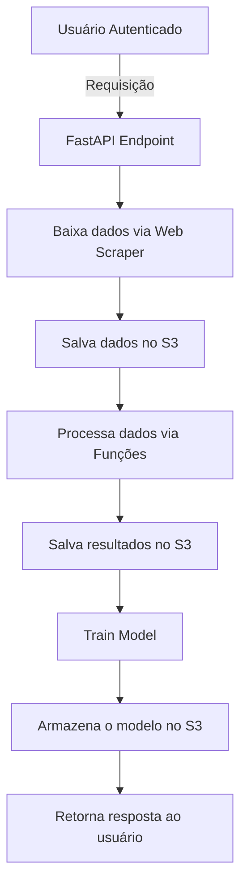
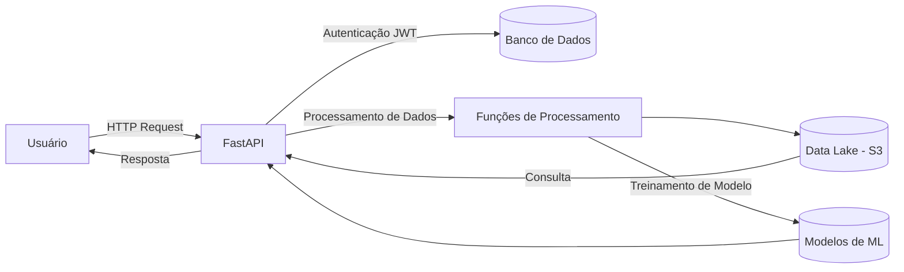

# FastAPI API Documentation

- Este repositório contém a implementação de uma API desenvolvida em FastAPI para manipular dados relacionados de produção, importação, exportação e comercialização de produtos da http://vitibrasil.cnpuv.embrapa.br .
A aplicação utiliza uma arquitetura de Data Lake no AWS S3 para que possa armazenar arquivos na Vinícola e posteriormente trabalhar em cima dos dados desses arquivos. 
Inicialmente, como primeira etapa desse projeto pensamos em uma arquitetura enxuta porem capaz de atender todas as necessidades de manipulação dos dados, de forma que torna simples e de baixo custo a expansão do projeto.
A aplicação também tem um pequeno recurso piloto que faz uso de machine learning para previsões de dados.


# Funcionalidades

- **Autenticação via JWT**: A API utiliza autenticação baseada em JWT para proteger os endpoints.
- **Operações com AWS S3**: Faz upload e download de arquivos para o S3 e manipula arquivos em formato Parquet.
- **Previsões com Machine Learning**: Modelos de previsão para diferentes produtos baseados em séries temporais.
- **Web Scraping**: Extrai dados de URLs específicas e armazena no data lake S3.

# Endpoints

- **Autenticação**:

  - **POST /usuarios/login**: Autentica um usuário e retorna um token JWT.
    - **Parâmetros**:
      - **username**: string - Nome de usuário
      - **password**: string - Senha do usuário
    - **Resposta**: 
     - **200 OK**: Token JWT válido
     - **401 Unauthorized**: Credenciais inválidas

  - **POST /usuarios/signup**: Cria um novo usuário.
    - **Parâmetros**:
      - **username**: string - Nome de usuário
      - **password**: string - Senha do usuário
      - **admin**: boolean (opcional) - Indica se o usuário terá privilégios de administrador
    - **Resposta**: 
      - **201 Created**: Usuário criado com sucesso
      - **406 Not Acceptable**: Nome de usuário já está em uso

  - **GET /usuarios/logado**: Retorna as informações do usuário autenticado.
    - **Cabeçalho**:
      - **Authorization**: Bearer <token>
    - **Resposta**: 
      - **200 OK**: Detalhes do usuário autenticado
      - **401 Unauthorized**: Token JWT inválido ou não fornecido

  - **GET /usuarios/usuarios**: Retorna uma lista de todos os usuários cadastrados no sistema.
    - **Resposta**: 
      - **200 OK**: Lista de usuários
  
  - **PUT /usuarios/{usuario_id}**: Atualiza os dados de um usuário específico..
    - **Parâmetros**:
      - **usuario_id**: int - ID do usuário a ser atualizado
      - **username**: string (opcional) - Nome de usuário
      - **password**: string (opcional) - Nova Senha
      - **admin**: boolean (opcional) - Atualizar privilégio de administrador
    - **Resposta**: 
      - **202 Accepted**: Usuário atualizado com sucesso
      - **404 Not Found**: Usuário não encontrado


- **Endpoints de Manipulação de Dados**:

  - **GET /producao/download-arquivo**: Baixa os dados de produção e os envia para o Data Lake (S3).
    - **Cabeçalho**:
      - **Authorization**: Bearer <token>
    - **Resposta**: 
      - **200 OK**: Dados enviados com sucesso ao Data Lake
      - **403 Forbidden**: Usuário não autorizado

  - **GET /processamento/download-arquivo**: Baixa os dados de processamento e os envia para o Data Lake (S3).
    - **Cabeçalho**:
      - **Authorization**: Bearer <token>
    - **Resposta**: 
      - **200 OK**: Dados de processamento enviados ao Data-Lake com sucesso
      - **403 Forbidden**: Usuário não autorizado

  - **GET /comercializacao/download-arquivo**: Baixa os dados de comercializacao e os envia para o Data Lake (S3).
    - **Cabeçalho**:
      - **Authorization**: Bearer <token>
    - **Resposta**: 
      - **200 OK**: Dados de comercializacao enviados ao Data-Lake com sucesso
      - **403 Forbidden**: Usuário não autorizado

  - **GET /importacao/download-arquivo**: Baixa os dados de importacao e os envia para o Data Lake (S3).
    - **Cabeçalho**:
      - **Authorization**: Bearer <token>
    - **Resposta**: 
      - **200 OK**: Dados de importacao enviados ao Data-Lake com sucesso
      - **403 Forbidden**: Usuário não autorizado
  
  - **GET /exportacao/download-arquivo**: Baixa os dados de exportacao e os envia para o Data Lake (S3).
    - **Cabeçalho**:
      - **Authorization**: Bearer <token>
    - **Resposta**: 
      - **200 OK**: Dados de exportacao enviados ao Data-Lake com sucesso
      - **403 Forbidden**: Usuário não autorizado

  - **GET /fetch-data**: Busca dados filtrados de um arquivo específico no S3..
    - **Parâmetros**:
      - **file_key**: string - Nome do arquivo no S3
      - **year_filter**: string -Filtro de ano para os dados
    - **Cabeçalho**:
      - **Authorization**: Bearer <token>
    - **Resposta**: 
      - **200 OK**: Dados retornados com sucesso
      - **403 Forbidden**: Usuário não autorizado    

  - **GET /fetch-data/tables**: Lista os arquivos disponíveis no bucket do S3.
    - **Cabeçalho**:
      - **Authorization**: Bearer <token>
    - **Resposta**: 
      - **200 OK**: Lista de arquivos do S3
      - **403 Forbidden**: Usuário não autorizado

- **Machine Learning**:

  - **GET /ml-models/train**: Treina modelos de previsão usando dados do S3.
    - **Parâmetros**:
      - **file_key**: string - Nome do arquivo de dados no S3
    - **Cabeçalho**:
      - **Authorization**: Bearer <token>
    - **Resposta**: 
      - **200 OK**: Dados retornados com sucesso
      - **403 Forbidden**: Usuário não autorizado

  - **GET /ml-models/predict**: Gera previsões futuras com base em dados existentes.
     - **Parâmetros**:
        - **file_key**: string - Nome do arquivo de dados no S3
        - **anos_futuros**: lista de strings -Anos para previsão
    - **Cabeçalho**:
        - **Authorization**: Bearer <token>
    - **Resposta**: 
      - **200 OK**: Dados retornados com sucesso
      - **403 Forbidden**: Usuário não autorizado

  - **GET /**: Endpoint raiz que retorna uma mensagem indicando que a API está em execução.
    - **Resposta**: 
      - **200 OK**: {"message": "API is running"}

# Instalação e Execução

- **Pré-requisitos**
  - **Python 3.10.2+**
  - **AWS CLI** configurado com as credenciais apropriadas

**Instalação**
1. Clone o repositório:
```bash
  https://github.com/Renatmf5/API-FastApi-WebScraping.gitt
  cd API-FastApi-WebScraping
```
2. Crie e ative um ambiente virtual:
```bash
  python -m venv venv
  source venv/bin/activate
```
3. Instale as dependências:
```bash
  pip install -r requirements.txt
```

4. Configure as variáveis de ambiente: Crie um arquivo .env com as variáveis necessárias:
```env
- JWT_SECRET= qualquer chave para usar no algoritmo HS256
- DATABASE_URL=sqlite:///./authDB.db
- BUCKET_NAME=nome do bucket de Data Lake
- ENV=development para rodar local
```

# Executando localmente

1. Inicie a aplicação FastApi:
```bash
  python main.py
```

# Testando a API
Você pode acessar a documentação interativa da API no formato Swagger ou ReDoc através das seguintes URLs:
- **Swagger UI**: http://127.0.0.1:8000/docs
- **ReDoc**: http://127.0.0.1:8000/redoc
## Estrutura do Projeto

```plaintext
├── README.md
├── api
│   ├── V1
│   │   ├── api.py                                        # Arquivo principal da API
│   │   └── endpoints                                     # Endpoints organizados por áreas funcionais
│   │       ├── comercializacao.py
│   │       ├── exportacao.py
│   │       ├── fetch_data_S3.py
│   │       ├── importacao.py
│   │       ├── processamento.py
│   │       ├── producao.py
│   │       ├── train_models.py
│   │       └── usuarios.py
│   └── utils                                             # Funções utilitárias para manipulação de dados e ML
│       ├── fetch_S3_files.py
│       ├── fetch_S3_to_ml_functions.py
│       ├── predicts.py
│       ├── scraper.py
│       ├── train_models.py
│       └── upfile_bucketS3.py
├── appspec.yml                                           # Scripts do CodeDeploy para deploy em AWS EC2
├── authDB.db
├── core                                                  # Core da aplicação (Autenticação, Configurações, DB)
│   ├── auth.py
│   ├── config.py
│   ├── database.py
│   └── services
│       └── parameterServiceAws.py
├── create_tables.py
├── main.py                                               # Arquivo principal para rodar a API          
├── models                                                # Modelos da aplicação
│   ├── ml_models                                         # Modelos treinados de ML
│   │   ├── model_DERIVADOS.pkl
│   │   ├── model_ESPUMANTES .pkl
│   │   ├── model_OUTROS PRODUTOS COMERCIALIZADOS.pkl
│   │   ├── model_SUCO DE UVAS CONCENTRADO.pkl
│   │   ├── model_SUCO DE UVAS.pkl
│   │   ├── model_SUCO.pkl
│   │   ├── model_VINHO  FINO DE MESA.pkl
│   │   ├── model_VINHO DE MESA.pkl
│   │   ├── model_VINHO ESPECIAL.pkl
│   │   ├── model_VINHO FINO DE MESA (VINIFERA).pkl
│   │   ├── model_VINHO FRIZANTE.pkl
│   │   └── model_VINHO ORGÂNICO.pkl
│   └── usuario_model.py  
├── requirements.txt                                       # Dependências do projeto
├── schemas                                                # Esquemas de dados
│   └── usuario_schema.py
├── scripts                                                # Scripts do CodeDeploy para deploy em AWS EC2
│   ├── after_install.sh
│   ├── application_start.sh
│   ├── application_stop.sh
│   └── before_install.sh
```

# Fluxograma do Processo de Manipulação de Dados


- **A**: Usuário autenticado faz a requisição à API.
- **B**: FastAPI processa a requisição e aciona a função de scraper ou upload para o S3.
- **C**: O scraper coleta os dados de fontes externas.
- **D**: Os dados são salvos no S3.
- **E**: Dados são processados (filtrados, transformados).
- **F**: Dados processados são novamente salvos no S3.
- **G**: Modelo de Machine Learning é treinado.
- **H**: Modelo treinado é salvo no S3.
- **I**: A resposta é retornada ao usuário

### 2. **Diagrama de Arquitetura da Aplicação**

Aqui, um diagrama de como sua aplicação FastAPI interage com os serviços da AWS (como S3 e EC2) e o banco de dados:


- **Client**: O usuário interage com a API.
- **FastAPI**: A aplicação principal que processa as requisições.
- **AuthDB**: Banco de dados usado para autenticação de usuários.
- **Processamento**: Funções de processamento de dados (como filtros e agregações).
- **S3**: Armazena os dados e os modelos.
- **MLModel**: Modelos de machine learning gerados pelo sistema.

- **Diagramas de sequência**:
  
  ```markdown
  ```mermaid
  sequenceDiagram
      participant User
      participant API
      participant S3
      participant Model
      User->>API: Envia Requisição
      API->>S3: Faz download de dados
      S3-->>API: Retorna dados
      API->>Model: Treina modelo
      Model-->>API: Retorna modelo treinado
      API-->>User: Retorna a resposta
  ```