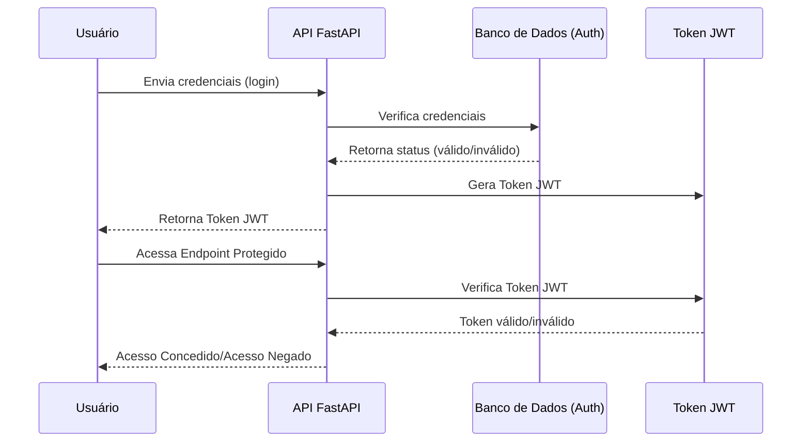

# FastAPI API Documentation

- Este repositório contém a implementação de uma API desenvolvida em FastAPI para manipular dados relacionados de produção, importação, exportação e comercialização de produtos da http://vitibrasil.cnpuv.embrapa.br .
A aplicação utiliza uma arquitetura de Data Lake no AWS S3 para que possa armazenar arquivos na Vinícola e posteriormente trabalhar em cima dos dados desses arquivos. 
Inicialmente, como primeira etapa desse projeto pensamos em uma arquitetura enxuta porem capaz de atender todas as necessidades de manipulação dos dados, de forma que torna simples e de baixo custo a expansão do projeto.
A aplicação também tem um pequeno recurso piloto que faz uso de machine learning para previsões de dados.


# Funcionalidades

- **Autenticação via JWT**: A API utiliza autenticação baseada em JWT para proteger os endpoints.
- **Operações com AWS S3**: Faz upload e download de arquivos para o S3 e manipula arquivos em formato Parquet.
- **Previsões com Machine Learning**: Modelos de previsão para diferentes produtos baseados em séries temporais.
- **Web Scraping**: Extrai dados de URLs específicas e armazena no data lake S3.

# Endpoints

- **Autenticação**:

  - **POST /usuarios/login**: Autentica um usuário e retorna um token JWT.
    - **Parâmetros**:
      - **username**: string - Nome de usuário
      - **password**: string - Senha do usuário
    - **Resposta**: 
     - **200 OK**: Token JWT válido
     - **401 Unauthorized**: Credenciais inválidas

  - **POST /usuarios/signup**: Cria um novo usuário.
    - **Parâmetros**:
      - **username**: string - Nome de usuário
      - **password**: string - Senha do usuário
      - **admin**: boolean (opcional) - Indica se o usuário terá privilégios de administrador
    - **Resposta**: 
      - **201 Created**: Usuário criado com sucesso
      - **406 Not Acceptable**: Nome de usuário já está em uso

  - **GET /usuarios/logado**: Retorna as informações do usuário autenticado.
    - **Cabeçalho**:
      - **Authorization**: Bearer <token>
    - **Resposta**: 
      - **200 OK**: Detalhes do usuário autenticado
      - **401 Unauthorized**: Token JWT inválido ou não fornecido

  - **GET /usuarios/usuarios**: Retorna uma lista de todos os usuários cadastrados no sistema.
    - **Resposta**: 
      - **200 OK**: Lista de usuários
  
  - **PUT /usuarios/{usuario_id}**: Atualiza os dados de um usuário específico..
    - **Parâmetros**:
      - **usuario_id**: int - ID do usuário a ser atualizado
      - **username**: string (opcional) - Nome de usuário
      - **password**: string (opcional) - Nova Senha
      - **admin**: boolean (opcional) - Atualizar privilégio de administrador
    - **Resposta**: 
      - **202 Accepted**: Usuário atualizado com sucesso
      - **404 Not Found**: Usuário não encontrado


- **Endpoints de Manipulação de Dados**:

  - **GET /producao/download-arquivo**: Baixa os dados de produção e os envia para o Data Lake (S3).
    - **Cabeçalho**:
      - **Authorization**: Bearer <token>
    - **Resposta**: 
      - **200 OK**: Dados enviados com sucesso ao Data Lake
      - **403 Forbidden**: Usuário não autorizado

  - **GET /processamento/download-arquivo**: Baixa os dados de processamento e os envia para o Data Lake (S3).
    - **Cabeçalho**:
      - **Authorization**: Bearer <token>
    - **Resposta**: 
      - **200 OK**: Dados de processamento enviados ao Data-Lake com sucesso
      - **403 Forbidden**: Usuário não autorizado

  - **GET /comercializacao/download-arquivo**: Baixa os dados de comercializacao e os envia para o Data Lake (S3).
    - **Cabeçalho**:
      - **Authorization**: Bearer <token>
    - **Resposta**: 
      - **200 OK**: Dados de comercializacao enviados ao Data-Lake com sucesso
      - **403 Forbidden**: Usuário não autorizado

  - **GET /importacao/download-arquivo**: Baixa os dados de importacao e os envia para o Data Lake (S3).
    - **Cabeçalho**:
      - **Authorization**: Bearer <token>
    - **Resposta**: 
      - **200 OK**: Dados de importacao enviados ao Data-Lake com sucesso
      - **403 Forbidden**: Usuário não autorizado
  
  - **GET /exportacao/download-arquivo**: Baixa os dados de exportacao e os envia para o Data Lake (S3).
    - **Cabeçalho**:
      - **Authorization**: Bearer <token>
    - **Resposta**: 
      - **200 OK**: Dados de exportacao enviados ao Data-Lake com sucesso
      - **403 Forbidden**: Usuário não autorizado

  - **GET /fetch-data**: Busca dados filtrados de um arquivo específico no S3..
    - **Parâmetros**:
      - **file_key**: string - Nome do arquivo no S3
      - **year_filter**: string -Filtro de ano para os dados
    - **Cabeçalho**:
      - **Authorization**: Bearer <token>
    - **Resposta**: 
      - **200 OK**: Dados retornados com sucesso
      - **403 Forbidden**: Usuário não autorizado    

  - **GET /fetch-data/tables**: Lista os arquivos disponíveis no bucket do S3.
    - **Cabeçalho**:
      - **Authorization**: Bearer <token>
    - **Resposta**: 
      - **200 OK**: Lista de arquivos do S3
      - **403 Forbidden**: Usuário não autorizado

- **Machine Learning**:

  - **GET /ml-models/train**: Treina modelos de previsão usando dados do S3.
    - **Parâmetros**:
      - **file_key**: string - Nome do arquivo de dados no S3
    - **Cabeçalho**:
      - **Authorization**: Bearer <token>
    - **Resposta**: 
      - **200 OK**: Dados retornados com sucesso
      - **403 Forbidden**: Usuário não autorizado

  - **GET /ml-models/predict**: Gera previsões futuras com base em dados existentes.
     - **Parâmetros**:
        - **file_key**: string - Nome do arquivo de dados no S3
        - **anos_futuros**: lista de strings -Anos para previsão
    - **Cabeçalho**:
        - **Authorization**: Bearer <token>
    - **Resposta**: 
      - **200 OK**: Dados retornados com sucesso
      - **403 Forbidden**: Usuário não autorizado

  - **GET /**: Endpoint raiz que retorna uma mensagem indicando que a API está em execução.
    - **Resposta**: 
      - **200 OK**: {"message": "API is running"}

# Instalação e Execução

- **Pré-requisitos**
  - **Python 3.10.2+**
  - **AWS CLI** configurado com as credenciais apropriadas

**Instalação**
1. Clone o repositório:
```bash
  https://github.com/Renatmf5/API-FastApi-WebScraping.gitt
  cd API-FastApi-WebScraping
```
2. Crie e ative um ambiente virtual:
```bash
  python -m venv venv
  source venv/bin/activate
```
3. Instale as dependências:
```bash
  pip install -r requirements.txt
```

4. Configure as variáveis de ambiente: Crie um arquivo .env com as variáveis necessárias:
```env
- JWT_SECRET= qualquer chave para usar no algoritmo HS256
- DATABASE_URL=sqlite:///./authDB.db
- BUCKET_NAME=nome do bucket de Data Lake
- ENV=development para rodar local
```

# Executando localmente

1. Inicie a aplicação FastApi:
```bash
  python main.py
```

# Testando a API
Você pode acessar a documentação interativa da API no formato Swagger ou ReDoc através das seguintes URLs:
- **Swagger UI**: http://127.0.0.1:8000/docs
- **ReDoc**: http://127.0.0.1:8000/redoc
## Estrutura do Projeto

```plaintext
├── README.md
├── api
│   ├── V1
│   │   ├── api.py                                        # Arquivo principal da API
│   │   └── endpoints                                     # Endpoints organizados por áreas funcionais
│   │       ├── comercializacao.py
│   │       ├── exportacao.py
│   │       ├── fetch_data_S3.py
│   │       ├── importacao.py
│   │       ├── processamento.py
│   │       ├── producao.py
│   │       ├── train_models.py
│   │       └── usuarios.py
│   └── utils                                             # Funções utilitárias para manipulação de dados e ML
│       ├── fetch_S3_files.py
│       ├── fetch_S3_to_ml_functions.py
│       ├── predicts.py
│       ├── scraper.py
│       ├── train_models.py
│       └── upfile_bucketS3.py
├── appspec.yml                                           # Scripts do CodeDeploy para deploy em AWS EC2
├── authDB.db
├── core                                                  # Core da aplicação (Autenticação, Configurações, DB)
│   ├── auth.py
│   ├── config.py
│   ├── database.py
│   └── services
│       └── parameterServiceAws.py
├── create_tables.py
├── main.py                                               # Arquivo principal para rodar a API          
├── models                                                # Modelos da aplicação
│   ├── ml_models                                         # Modelos treinados de ML
│   │   ├── model_DERIVADOS.pkl
│   │   ├── model_ESPUMANTES .pkl
│   │   ├── model_OUTROS PRODUTOS COMERCIALIZADOS.pkl
│   │   ├── model_SUCO DE UVAS CONCENTRADO.pkl
│   │   ├── model_SUCO DE UVAS.pkl
│   │   ├── model_SUCO.pkl
│   │   ├── model_VINHO  FINO DE MESA.pkl
│   │   ├── model_VINHO DE MESA.pkl
│   │   ├── model_VINHO ESPECIAL.pkl
│   │   ├── model_VINHO FINO DE MESA (VINIFERA).pkl
│   │   ├── model_VINHO FRIZANTE.pkl
│   │   └── model_VINHO ORGÂNICO.pkl
│   └── usuario_model.py  
├── requirements.txt                                       # Dependências do projeto
├── schemas                                                # Esquemas de dados
│   └── usuario_schema.py
├── scripts                                                # Scripts do CodeDeploy para deploy em AWS EC2
│   ├── after_install.sh
│   ├── application_start.sh
│   ├── application_stop.sh
│   └── before_install.sh
```

# Fluxograma do Processo de Autenticação da API

## 1. **Diagrama de autenticação**

```mermaid
graph TD;
    A[Usuário] -->|Envia credenciais| B[FastAPI /usuarios/login]
    B --> C[Verifica no Banco de Dados (Auth)]
    C -->|Credenciais válidas| D[Gera Token JWT]
    D --> E[Retorna Token JWT ao Usuário]
    
    A -->|Acessa Endpoint Protegido| F[FastAPI Endpoint Protegido]
    F -->|Verifica Token| G[Middleware de Autorização]
    G -->|Token válido| H[Acesso Concedido]
    G -->|Token inválido| I[Acesso Negado]
```
#### **Legenda para o Diagrama de Arquitetura**:

- **A [Usuário]**: Representa o cliente que tenta acessar a API.
- **B [FastAPI /usuarios/login]**: Endpoint de login da API onde o usuário envia suas credenciais (nome de usuário e senha).
- **C [Verifica no Banco de Dados (Auth)]**: A API faz uma consulta ao banco de dados para verificar se as credenciais fornecidas são válidas.
- **D [Gera Token JWT]**: Caso as credenciais sejam válidas, a API gera um token JWT (JSON Web Token) para autenticação.
- **E [Retorna Token JWT ao Usuário]**: O token JWT é retornado ao usuário, que pode usá-lo para acessar endpoints protegidos.
- **F [FastAPI Endpoint Protegido]**: O usuário tenta acessar um endpoint que exige autenticação.
- **G [Middleware de Autorização]**: Um middleware da FastAPI verifica o token JWT incluído na requisição.
- **H [Acesso Concedido]**: Se o token JWT for válido, o usuário recebe acesso ao recurso protegido.
- **I [Acesso Negado]**: Se o token for inválido ou ausente, o acesso ao recurso é negado.

### **2. Diagrama de Sequência: Autenticação e Autorização**

```markdown

#### **Legenda para o Diagrama de Sequência**:

1. **User [Usuário]**: O cliente envia suas credenciais para login.
2. **API [FastAPI]**: A API processa a requisição e verifica as credenciais no banco de dados.
3. **AuthDB [Banco de Dados (Auth)]**: O banco de dados de autenticação, que armazena as credenciais dos usuários.
4. **JWT [Token JWT]**: O token JWT é gerado pela API se as credenciais forem válidas e é usado posteriormente para autorização.


# Fluxograma do Processo de Manipulação de Dados

### 1. **Diagrama de Arquitetura da Aplicação**

Aqui, um diagrama de como sua aplicação FastAPI interage com os serviços da AWS (como S3 e EC2) e o banco de dados:


- **[Usuário]**: Representa o cliente ou usuário que interage com a API
- **[FastAPI Endpoint /login]**: O endpoint da API que recebe as credenciais do usuário para autenticação.
- **[Verifica credenciais no Banco de Dados]**: A API faz uma verificação das credenciais no banco de dados de autenticação.
- **[FastAPI /producao/download]**: Endpoint que processa uma requisição para baixar dados de produção, por exemplo.
- **[Executa Web Scraper]**: Executa um web scraper que coleta dados de uma fonte externa (como um site).
- **[Envia dados para S3]**: Os dados coletados pelo scraper são enviados e armazenados no AWS S3 (Data Lake).
- **[Confirma armazenamento]**: Confirma que os dados foram enviados e armazenados com sucesso no S3.
- **[FastAPI /ml-models/train]**: Endpoint que processa uma solicitação de treinamento de modelo de machine learning.
- **[Treina modelo de ML]**: A API faz o download dos dados armazenados no S3 para treinamento do modelo.
- **[Armazena modelo no S3]**: O processo de treinamento de um modelo de machine learning com os dados baixados. 
- **[Confirma treinamento]**: O modelo treinado é armazenado no S3 para uso posterior. 
- **[FastAPI /ml-models/predict]**: Endpoint que processa uma solicitação de previsão.
- **[Baixa modelo do S3]**: A API faz o download do modelo treinado do S3 para gerar previsões.   
- **[Gera previsões]**: O processo de geração de previsões com base no modelo baixado.    

### 2.  - **Diagramas de sequência**:


- **[Usuário]**: Representa o cliente ou usuário interagindo com a API.
- **[API FastAPI]**:A aplicação principal que gerencia as requisições e interações com os serviços.
- **[Banco de Dados (Auth)]**: O banco de dados usado para armazenar e verificar as credenciais de autenticação.
- **[Data Lake (AWS S3)]**: O repositório de armazenamento usado como Data Lake para manter dados brutos e processados
- **[Web Scraper]**: O componente que faz web scraping para coletar dados de fontes externas.
- **[Envia dados para S3]**: Os dados coletados pelo scraper são enviados e armazenados no AWS S3 (Data Lake).
- **[Machine Learning Model]**: O modelo de machine learning que é treinado e utilizado para gerar previsões.